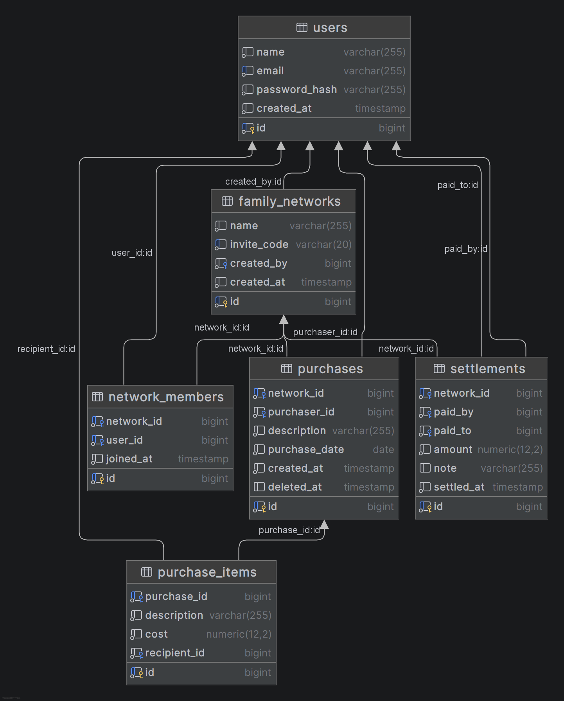

# Purchase Tracker

A full-stack web application that tracks informal purchases between
extended family members — replacing text threads, paper receipts, and
manual math with a live, always-current ledger.

**[ LIVE DEMO →](https://purchase-tracker-betterui.vercel.app/)**
&nbsp;•&nbsp;
**[ ORIGINAL UNSTYLED VERSION →](https://purchase-tracker-silk.vercel.app/)**
&nbsp;•&nbsp;
**[ DEV LOG →](./DEVLOG.md)**

*Both frontends above point to the same live backend and API — the
unstyled version is kept live intentionally, as a before/after reference
alongside the polished one. They're two separate branches of the same
repo: `master` is the original, unstyled build; `frontend-styling-overhaul`
is the polished version.*

---

## The Problem

Between my family and friends, people constantly buy things for each other on
impulse — "found a deal, grabbed one for you too, we'll figure it out
later." That "figuring out later" meant digging through old text
threads, hunting for paper receipts, and doing balance math by hand.
This app replaces all of that with one shared, always-correct ledger.

## Key Features

- **Itemized, multi-recipient purchases** — one shopping trip can include
  items for several different people, each tagged to its own recipient,
  instead of forcing an even split across a fixed group
- **Flat family networks, not rigid groups** — anyone in a network can
  log a purchase involving anyone else in it, matching how these
  purchases actually happen in real life
- **Derived, always-current balances** — nothing is stored or manually
  adjusted; every balance is recomputed fresh from the full purchase and
  settlement history on every read, eliminating an entire class of
  "stored balance drifted out of sync" bugs
- **Settlement recording** — log a real payment and watch balances update
  instantly, including correct handling of partial payments and
  overpayments
- **JWT-based authentication** — bcrypt-hashed passwords, stateless
  token auth, and endpoint-level authorization (not just "are you logged
  in," but "are you actually allowed to see this specific resource")
- **Rate-limited auth endpoints** to make credential brute-forcing
  impractical


## Architecture

```
React (TypeScript, Vite)
        │  HTTPS / JSON, JWT bearer auth
        ▼
Spring Boot REST API  ──▶  Spring Data JPA / Hibernate
        │
   Flyway (schema migrations, run on startup)
        ▼
PostgreSQL
```

Backend and frontend are deployed and scaled independently — Railway for
the API and database, Vercel for the frontend — communicating purely
over a versioned REST API, so either side could be replaced or extended
(a mobile client, for instance) without touching the other. The frontend
itself exists as two branches deployed side by side: `master` (original)
and `frontend-styling-overhaul` (polished) — both built against the same
backend, no API changes between them.

## Data Model




**Two deliberate schema decisions worth calling out:**

- **No fixed groups.** Most expense-splitting apps model rigid groups
  ("Roommates," "Trip to Japan"). Real purchases in my family happen
  spontaneously between any two people, with no natural group boundary
  — so the schema uses one flat network per extended family instead.
- **Balances are derived, never stored.** Rather than a mutable balance
  column that gets manually adjusted on every purchase or payment,
  balances are always recomputed from the full `purchase_items` +
  `settlements` history. More computation per read, but it removes an
  entire category of bug where a stored value quietly drifts out of sync
  with reality — and it's fully covered by automated tests.

## Tech Stack

| Layer | Technology |
|---|---|
| Backend | Java 21, Spring Boot 4, Spring Security, Spring Data JPA / Hibernate |
| Database | PostgreSQL, Flyway (versioned schema migrations) |
| Auth | JWT (jjwt), bcrypt password hashing |
| Testing | JUnit 5, Mockito |
| Frontend | React, TypeScript, Vite, Axios |
| Local dev | Docker / Docker Compose |
| Deployment | Railway (API + Postgres), Vercel (frontend) |

---

## Running It Locally

**Prerequisites:** Java 21, Docker Desktop, Node.js

```bash
git clone https://github.com/dkkpd/purchase-tracker.git
cd purchase-tracker/backend

# start the database
docker compose up -d

# run the backend
./mvnw spring-boot:run   # or open in your IDE and run BackendApplication

# in a second terminal — the frontend
cd ../frontend
npm install
npm run dev
```

Visit `http://localhost:5173`. The backend health check is at
`http://localhost:8080/api/health`.

**Note on frontend versions:** the steps above run whichever branch
you're currently on. `master` is the original, unstyled frontend;
`frontend-styling-overhaul` is the polished version. Switch branches
before installing/running the frontend if you want a specific one:
```bash
git checkout frontend-styling-overhaul   # polished version
# or
git checkout master                       # original, unstyled version
```

---

## Challenges & What I Learned

**Building JWT authentication from scratch.** Rather than reaching for a
managed auth provider, I implemented the full flow myself — bcrypt
hashing, token issuance and validation, and a custom Spring Security
filter that authenticates every request. Understanding exactly how
Spring Security's filter chain processes a request, and where a custom
filter needs to sit in it, took real time to work through — but it means
I can actually explain every step of how a request gets authenticated,
not just that it works.

**Getting derived balances correct, including a real bug I caught with
a test.** The balance-netting algorithm collapses every purchase and
settlement between any two people into a single signed value, keyed
canonically so the same relationship always nets to one entry regardless
of which direction a given transaction ran. While testing settlements, I
found a sign error where a payment was doubling an existing debt instead
of canceling it — a `paidBy`/`paidTo` argument order mismatch between how
purchases and settlements applied debt. I later wrote a Mockito-based
unit test that reproduces and formally guards against that exact
regression, isolating the algorithm from any real database so the test
verifies the arithmetic itself, not the framework underneath it.

**Deploying with correctly separated environments.** Every
environment-specific value (database connection, JWT secret, CORS
origin) is read from environment variables with safe local-development
fallbacks, rather than hardcoded — including working through a couple of
real, non-obvious platform-specific gotchas (Railway's default
`DATABASE_URL` isn't directly usable as a Spring Boot JDBC URL; the
public vs. private connection string distinction affects both cost and
security).

*For the full, unfiltered build log — every phase, every bug, and the
reasoning behind every design decision, written as I went — see
[DEVLOG.md](./DEVLOG.md).*

---
## Future Improvements

**Mobile app.** The core use case — logging a purchase right after a
phone call, ideally with a receipt photo — is fundamentally a mobile
moment, not a web one. A React Native app (or similar) would let this live where
it's actually needed, with real camera access instead of a browser file
picker.

**Receipt scanning with automatic item extraction.** Snap a photo of a
receipt, run it through a receipt-parsing OCR API (something purpose-
built for structured line-item extraction — e.g. Veryfi or Taggun —
rather than generic OCR, since it returns `{item, price}` pairs directly
instead of raw text to parse manually), then tag which items are for
someone else and send them off in one action. Items would default to
"me" so only the few that need reassigning require a tap — turning a
30-45 second manual entry into something closer to 5 seconds.

**Debt simplification across a network.** Right now balances are shown
pairwise; if A owes B and B owes C, that's two separate debts a person
has to track. A minimum-cash-flow algorithm could collapse a tangled web
of debts within a network into the smallest possible number of actual
payments needed to settle everyone up. This is an interesting problem that I would like to look more into in the future. It's sort of an implementation of a greedy algorithm.

**Push notifications.** When someone tags you as a recipient on a
purchase (especially relevant once receipt scanning exists), a
notification makes it feel immediate rather than something you have to
remember to go check.